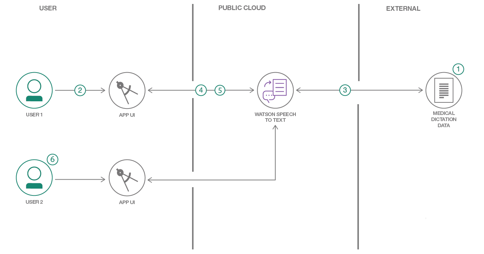

[](https://travis-ci.org/IBM/Train-Custom-Speech-Model)

# Create a custom Watson Speech to Text model using specialized domain data

In this code pattern, we will create a custom speech to text model. The `Watson Speech to Text` service is among the best in the industry. However, like other Cloud speech services, it was trained with general conversational speech for general use; therefore it may not perform well in specialized domains such as medicine, law, sports, etc. To improve the accuracy of the speech-to-text service, you can leverage transfer learning by training the existing AI model with new data from your domain.

In this example, we will use a medical speech data set to illustrate the process. The data is provided by [ezDI](https://www.ezdi.com) and includes 16 hours of medical dictation in both audio and text files.

When the reader has completed this code pattern, they will understand how to:

* Prepare audio data and transcription text for training a speech-to-text model.
* Work with the `Watson Speech to Text` service through API calls.
* Train a custom speech-to-text model with a data set.
* Enhance the model with continuous user feedback.



## Flow

1. The user downloads the custom medical dictation data set from [ezDI](https://www.ezdi.com) and prepares the audio and text data for training.
1. The user interacts with the Watson Speech to Text service via the provided application UI or by executing command line Python scripts.
1. The user requests the custom data be used to create and train a language and acoustic Watson Speech to Text model.
1. The user interactively tests the new custom model by submitting audio files and verifying the text transcription returned from the model.
1. If the text transcription is not correct, the user can make corrections and resubmit the updated data for additional training.
1. Several users can work on the same custom model at the same time.

## Included components

* [IBM Watson Speech to Text](https://www.ibm.com/watson/services/speech-to-text): easily convert audio and voice into written text for quick understanding of content.

## Featured technologies

* [Node.js](https://nodejs.org/): An open-source JavaScript run-time environment for executing server-side JavaScript code.
* [React](https://reactjs.org/): A JavaScript library for building User Interfaces.
* [Watson Speech recognition](https://console.bluemix.net/docs/services/speech-to-text/getting-started.html#gettingStarted): Advanced models for processing audio signals and language context can accurately transcribe spoken voice into text.
* [Watson Speech customization](https://console.bluemix.net/docs/services/speech-to-text/custom.html#customization): Ability to further train the model to improve the accuracy for your special domain.
* [AI in medical services](https://www.ezdi.com): Save time for medical care providers by automating tasks such as entering data into Electronic Medical Record.

# Watch the Video

[](https://youtu.be/bBLu1Ap8c7c)

# Steps

1. [Clone the repo](#1-clone-the-repo)
1. [Create IBM Cloud services](#2-create-ibm-cloud-services)
1. [Configure credentials](#3-configure-credentials)
1. [Download and prepare the data](#4-download-and-prepare-the-data)
1. [Train the models](#5-train-the-models)
1. [Transcribe your dictation](#6-transcribe-your-dictation)
1. [Correct the transcription](#7-correct-the-transcription)

## 1. Clone the repo

```bash
git clone https://github.com/IBM/Train-Custom-Speech-Model
```

## 2. Create IBM Cloud services

Create the following services:

* [**Watson Speech To Text**](https://cloud.ibm.com/catalog/services/speech-to-text)

> Note: In order to perform customization, you will need to select the `Standard` paid plan.

## 3. Configure credentials

From your **Watson Speech to Text** service instance, select the `Service Credentials` tab.

If no credentials exist, select the `New Credential` button to create a new set of credentials.

Save off the `apikey` and `url` values as they will be needed in future steps.

## 4. Download and prepare the data

Go to the [ezDI](https://www.ezdi.com/open-datasets/) web site and download both the medical dictation audio files and the transcribed text files. The downloaded files will be contained in zip files.

Create both an `Audio` and `Documents` subdirectory inside the `data` directory and then extract the downloaded zip files into their respective locations.

The transcription files stored in the `Documents` directory will be in **rtf** format, and need to be converted to plain text. You can use the `convert_rtf.py` Python script to convert them all to **txt** files. Run the following code block from the `data` directory to create a virtual environment, install dependencies, and run the conversion script. Note, you must have Python 3.

```bash
python3 -m venv .venv
source .venv/bin/activate
pip install striprtf
python convert_rtf.py
```

The data needs careful preparation since our deep learning model will only be as good as the data used in the training. Preparation may include steps such as removing erroneous words in the text, bad audio recordings, etc. These steps are typically very time-consuming when dealing with large datasets.

Although the dataset from `ezDI` is already curated, a quick scan of the text transcription files will reveal some filler text that would not help the training. These unwanted text strings have been collected in the file [data/fixup.sed](data/fixup.sed) and can be removed from the text files by using the *sed* utility.

Also, for the purpose of training, we will need to combine all text files into a single package, called a `corpus` file.

To remove the unwanted text strings and to combine all of the text files into a single `corpus` file, perform the following command:

```bash
sed -f fixup.sed Documents/*.txt > corpus-1.txt
```

For the audio files, we can archive them as zip or tar files. Since the `Watson Speech to Text` API has a limit of 100MB per archive file, we will need to split up the audio files into 3 zip files. We will also set aside the first 5 audio files for testing.

```bash
zip audio-set1.zip -xi Audio/[6-9].wav Audio/[1-7][0-9].wav
zip audio-set2.zip -xi Audio/[8-9][0-9].wav Audio/1[0-6][0-9].wav
zip audio-set3.zip -xi Audio/1[7-9][0-9].wav Audio/2[0-4][0-9].wav
```

## 5. Train the models

To train the language and acoustic models, you can either run the application or use the command line interface. Or you can mix as desired, since both are working with the same data files and services.

### a. Run the application

The application is a *nodejs* web service running locally with a GUI implemented in *React*.

* Install [Node.js](https://nodejs.org/en/) runtime or NPM.

To allow the web service to connect to your **Watson Speech to Text** service, create in the root directory a file named `services.json` by copying the sample file `services.sample.json`. Update the `apikey` and 'url' fields in the newly created file with your own values that were retrieved in [Step 3](#3-configure-credentials).

```json
{
  "services": {
    "code-pattern-custom-language-model": [
      {
        "credentials": {
          "apikey": "<your api key>",
          "url": "<your api url>"
        },
        "label": "speech_to_text",
        "name": "code-pattern-custom-language-model"
      }
    ]
  }
}
```

The application will require a local login. The local user accounts are defined in the file [model/user.json](model/user.json). The pre-defined user/passwords are `user1/user1` and `user2/user2`. The `langModel` and `acousticModel` fields are the names of your custom language and acoustic models which will be created upon logging in if they do not already exist. You can change the `baseModel` field if the base model you are working with is different from our default. Here is an example of user3 using Korean as base language for transcribing. See [Supported language models](https://cloud.ibm.com/docs/services/speech-to-text?topic=speech-to-text-models#modelsList).

```json
{
	"user3": {
		"password": "user3",
		"langModel": "custom-korean-language",
		"acousticModel": "custom-korean-acoustic",
		"baseModel": "ko-KR_NarrowbandModel"
	}
}
```

Install and start the application by running the following commands in the root directory:

```bash
npm install
npm run dev
```

The local nodejs web server will automatically open your browser to [http://localhost:3000](http://localhost:3000).


Before training the model, you must add the corpus and audio files. The files can be uploaded using the panels displayed in the `Corpora` and `Audio` tabs of the application UI.

Then select the `Train` tab to show the training options. Train both the `Language Model` and `Acoustic Model`.


> Note: Training the acoustic model can potentially take hours to complete.

### b. Use the Command Line interface

If you prefer to use the command line, set the following environment variables. Update the `<your-iam-api-key>` and `<url>` values with the values retrieved in [Step 3](#3-configure-credentials).

```bash
export USERNAME=apikey
export PASSWORD=<your-iam-api-key>
export STT_ENDPOINT=<your-url>
```

To keep all of the generated data files in the proper directory, set the current directory to `data` before executing any of the following commands:

```bash
cd data
```

> Note: For a more detailed description of the available commands, see the [README](cmd/README.md) located in the `cmd` directory.

#### Install dependencies

The Python scripts use the package *requests*.  If you don't have it already, install it with:

```bash
pip install requests
```

#### Train the language model

To create your custom language model and your corpus of medical dictation, run:

```bash
python ../cmd/create_language_model.py "custom-model-1"
```

Note that we are naming our acoustic model "custom-model-1", just to be consistent with the default name that will be used by the application if logged in as `user1`.

This script will return the ID of your custom model. Use it to set the following environment variable:

```bash
export LANGUAGE_ID=<id_for_your_model>
```

> Note: You can also obtain the ID by using the following command:
>
>```bash
>python ../cmd/list_language_model.py
>```

The custom model will stay in the *"pending"* state until a corpus of text is added. Add the medical transcription file we created in an earlier step.

```bash
python ../cmd/add_corpus.py corpus-1.txt
python ../cmd/list_corpus.py
```

This step will also save a new list of `Out-Of-Vocabulary` words in a file (the file will be created in current directory and will end in `OOVs.corpus`). `Out-Of-Vocabulary` words are words that are not a part of the basic Watson Speech-to-Text service, but will be added and used to train the language model. It may be useful to check the words in the file to see if there are any unexpected words that you don't want to train the model with.

The status of the custom language model should now be set to *"ready"*. Now we can train the language model using the medical transcription.

```bash
python ../cmd/train_language_model.py
```

Training is asynchronous and may take some time depending on the system workload.
You can check for completion with `cmd/list_language_model.py`. When training is complete, the status will change from *"training"* to *"available"*.

#### Train the acoustic model

Create the custom acoustic model based on the custom language model.

> Note: Since the audio files are sampled at the 8Khz rate, we will need to create a narrow band model, which is coded in the `create_acoustic_model.py` python script.

```bash
python ../cmd/create_acoustic_model.py "acoustic-model-1"
```

Note that we are naming our acoustic model "acoustic-model-1", just to be consistent with the default name that will be used by the application if logged in as `user1`.

This script will return the ID of your custom acoustic model. Use it to set the following environment variable:

```bash
export ACOUSTIC_ID=<id_for_your_model>
```

The custom acoustic model will be in the *"pending"* state until some audio data is added. Add the 3 zip files containing the audio clips with the following commands:

```bash
python ../cmd/add_audio.py audio-set1.zip
python ../cmd/add_audio.py audio-set2.zip
python ../cmd/add_audio.py audio-set3.zip
python ../cmd/list_audio.py
```

> Note: it may take some time to process each audio file. If processing is not completed yet, the command will return a *409* error message; in this case, simply retry later.

When the status of the custom acoustic model is set to *"ready"*, you can start the training by running:

```bash
python ../cmd/train_acoustic_model.py
```

Training the acoustic model is asynchronous and can potentially take hours to complete. To determine when training is completed, you can query the model and check if the status has changed from *"training"* to *"available"*.

```bash
python ../cmd/list_acoustic_model.py
```

## 6. Transcribe your dictation

To try out the model, either create your own recorded medical dictation in wav format (use 8KHz sampling rate), or use one of the first 5 test wav files located in `/data/Audio` (remember, we left those out of the data set used to train the model).

If running the application, click on the `Transcribe` tab and then browse to your wav file.  You can select any combination of base or custom model for language and acoustic.  Using custom model for both should give the best result.

If using the command line, enter the following:

```bash
python ../cmd/transcribe.py <my_dictation.wav>
```

Similarly to the application, you can set or unset the environment variables `LANGUAGE_ID` and `ACOUSTIC_ID` to select any combination of base or custom model for language and acoustic. If the corresponding variable is unset, the base model will be used. The transcription will be displayed on the terminal as well as written to a file with the same name as the audio file but with the file extension `.transcript`.

## 7. Correct the transcription

If you detect errors in the transcribed text, you can re-train the models by submitting corrected transcriptions.

If using the application, from the `Transcribe` panel, correct the transribed text.


If the audio file being transcribed is not already included in the acoustic model, check the `Add audio file to acoustic model` checkbox.

Enter a corpus name, and hit `Submit`.

The language and acoustic models will be re-trained with the new files.

If using the command line, you can directly edit the transcription output file generated in the previous step. You can then add the corrected text as a new corpus, and add the audio file as a new audio source.

> Note: If correcting multiple transcriptions, it will be more efficient to aggregate the corrected text files and audio clips before re-training the models. (See [Step #4](#4-download-and-prepare-the-data) for examples on how to aggregate the files, and [Step #5](#5-train-the-models) for how to re-train the models using the command line)

# Sample output

* The main GUI screen:


* Status for training of the models:


* List of "Out of Vocabulary" words determined during training:


> Note: These are the words that are not a part of the base `Watson Speech to Text` service, but will be added to the language model.

# Links

* [Demo on Youtube](https://www.youtube.com/watch?v=bBLu1Ap8c7c): Watch the video

# Troubleshooting

* Error: Please set your username in the environment variable USERNAME. If you use IAM service credentials, set USERNAME set to the string "apikey" and set PASSWORD to the value of your IAM API key.

  > If you choose to use the command line, make sure you set up your environment variables.

* *409* error message.

  > This indicates the service is busy. Try the command again later.

* Error uploading the audio files:

  > Since the audio files are large (70-90MB), you may encounter error when uploading them because of unstable network connection.  In this case, you can break up the files into smaller files and upload them.  The training for the acoustic model will work the same way.

  For example, the command to zip the first audio file as described above:

  ```bash
  zip audio-set1.zip -xi Audio/[6-9].wav Audio/[1-7][0-9].wav
  ```

  To break up into two smaller files, adjust the regular expression as appropriate:

  ```bash
  zip audio-set1a.zip -xi Audio/[6-9].wav Audio/[1-3][0-9].wav
  zip audio-set1b.zip -xi Audio/[4-7][0-9].wav
  ```

# Deploy on IBM Cloud

Instructions for deploying the web application on Cloud Foundry can be found [here](doc/cloud-deploy.md).

# Learn more

* **Artificial Intelligence Code Patterns**: Enjoyed this Code Pattern? Check out our other [AI Code Patterns](https://developer.ibm.com/technologies/artificial-intelligence/)
* **AI and Data Code Pattern Playlist**: Bookmark our [playlist](https://www.youtube.com/playlist?list=PLzUbsvIyrNfknNewObx5N7uGZ5FKH0Fde) with all of our Code Pattern videos
* **With Watson**: Want to take your Watson app to the next level? Looking to utilize Watson Brand assets? [Join the With Watson program](https://www.ibm.com/watson/with-watson/) to leverage exclusive brand, marketing, and tech resources to amplify and accelerate your Watson embedded commercial solution.

# License

This code pattern is licensed under the Apache Software License, Version 2.  Separate third party code objects invoked within this code pattern are licensed by their respective providers pursuant to their own separate licenses. Contributions are subject to the [Developer Certificate of Origin, Version 1.1 (DCO)](https://developercertificate.org/) and the [Apache Software License, Version 2](https://www.apache.org/licenses/LICENSE-2.0.txt).

[Apache Software License (ASL) FAQ](https://www.apache.org/foundation/license-faq.html#WhatDoesItMEAN)
